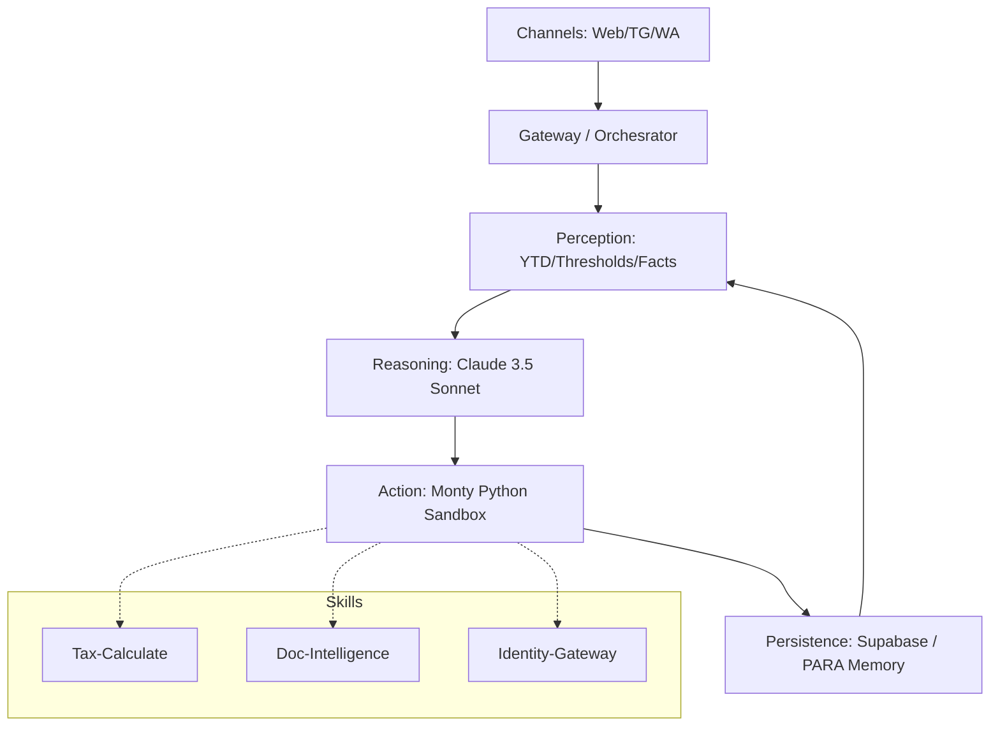

# PRISM Architecture Map (V35)

## System Overview
PRISM is an agentic tax assistant built on a modular, perception-reasoning-action architecture.

## Architecture Diagram

## Component Status

| Component | Status | Details |
|:---|:---|:---|
| **Orchestrator** | ✅ Stable | Logic bridge between AI and Tools. |
| **Monty Sandbox** | ✅ Stable | Secure, high-performance Python execution. |
| **PARA Memory** | ✅ Finalized | Projects/Areas/Resources/Archives structure. |
| **Heartbeat Mine**| ✅ Active | Autonomous fact extraction from logs. |
| **YTD Hydrator** | ✅ Active | Syncs bank transactions to YTD summaries. |
| **Metadata Ghost** | ✅ Active | Privacy compliance (Purge-on-Verify). |

## Data Flow: Statement Hydration & Ghosting
1. **Intake**: User uploads bank statement.
2. **Extraction**: `BankStatementExtractor` pulls transactions + calculates SHA-256 ghost.
3. **Classification**: 3-tier pipeline (Patterns -> Rules -> AI).
4. **Hydration**: `StatementHydrator` aggregates verified transactions into `ytd_state`.
5. **Ghosting**: `GhostService` permanently deletes original binary; stores hash.
6. **Perception**: Agent reads `ytd_state` to provide proactive advice.
