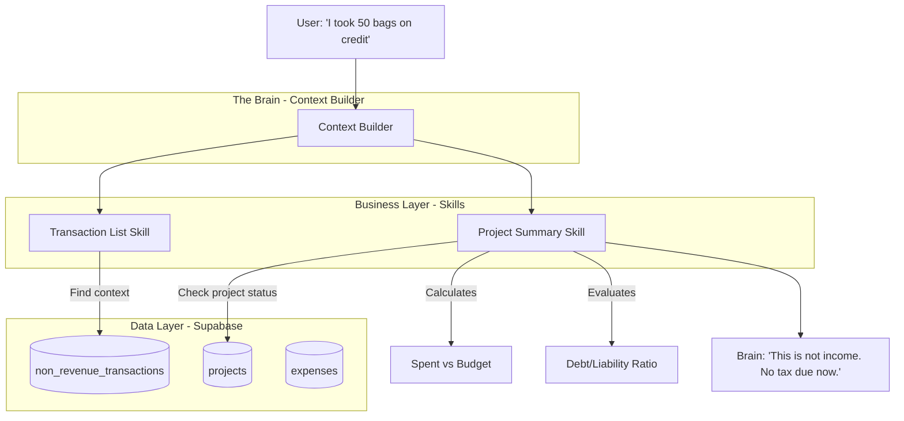

# PRISM Project Logic & Debt Handling Documentation

## 1. Overview: The "Stocking on Credit" Challenge
In the Nigerian context, many businesses "stock up" inventory on credit or through informal debt. 
- **The Problem**: Receiving inventory (Asset) on credit (Liability) is NOT income. 
- **The Risk**: If an AI assistant sees "Inventory In" or "Funds In" and mistakes it for Sales/Revenue, it will over-calculate tax (PIT/CIT) and VAT.

---

## 2. Current Implementation: "Agency Funds" Logic
PRISM currently uses the **Project** system to handle funds that are not personal income. This follows Section 5 (Agency Funds) of the Nigerian Tax principles.

### How it Works:
1.  **Non-Revenue Transactions**: PRISM has a dedicated `non_revenue_transactions` table for:
    - **Loans** (Debt)
    - **Capital Injections** (Owner's money)
    - **Refunds**
2.  **Project Budgeting**: A project is created with a `budget` (e.g., ₦1,000,000 credit limit).
3.  **Expense Tracking**: As stock is purchased or taken, it is recorded as a `project_expense`.
4.  **Tax Neutrality**: These transactions are excluded from VAT (input) and are not counted as taxable revenue for PIT/CIT under the `is_agency_fund` flag.

### The "Taxable Excess" Rule:
*Per Section 58 of Nigeria Tax Act 2025*: If a project is completed and there is a surplus (`budget` > `spent`), PRISM automatically flags the excess as **PIT Taxable Income**. This prevents users from "hiding" income as permanent "agency funds".

---

## 3. Centralized Architecture: Project Intelligence
To handle credit/debt properly, PRISM uses a centralized flow between the Brain and the Business Layer.

---

## 4. Proposed Improvements: "Credit/Liability" Logic
To fully support "Stocking on Credit" as requested, we need to extend the Project logic:

### A. Explicit Liability Tracking
Currently, we only track "Spent". We should add `accounts_payable` to the project state.
- **Current**: `budget` - `spent` = `remaining`
- **Proposed**: `budget` - (`cash_spent` + `credit_taken`) = `true_remaining`

### B. COGS Integration
When a user "stocks up" via credit, it shouldn't just be a generic expense. It should be tagged as **Closing Stock (Asset)**. This ensures that when the items are SOLD (Revenue), the cost of that stock is deducted from the profit.

### C. Skill Update: `business.projects.summary`
The skill should be updated to return a "Liability Warning" if a user is stocking up heavily on debt without corresponding sales growth.

---

## 6. Concrete Example: ₦25M Solar Inventory on Credit
**User Scenario**: "I just took ₦25M worth of solar panels, lithium batteries, and inverters on credit from SolarDistro Ltd."

### How V26 Handles This:
1.  **Event Recognition**: PRISM identifies the intent as `LOG_LIABILITY_INVENTORY`.
2.  **Accounting Entry (Non-Income)**:
    - **Increase Inventory (Asset)**: +₦25,000,000
    - **Increase Accounts Payable (Liability)**: +₦25,000,000
    - **Revenue Tracking**: ₦0.
3.  **Tax Calculation Impact**:
    - **Immediate Tax**: **₦0**. PRISM will NOT add this to your monthly revenue.
    - **VAT Input**: If you have a valid VAT invoice, PRISM logs it as *Pending Input VAT* but doesn't claim it until payment is scheduled/made (depending on your cash vs. accrual setting).
4.  **Assurance for V26**:
    - By introducing the **Inventory Ledger**, PRISM becomes "Double-Entry Aware." 
    - It will track the **Cost of Goods Sold (COGS)**. When you sell one battery for ₦1,000,000, PRISM will find the cost (e.g., ₦800,000) from that ₦25M "credit pool" and only tax you on the ₦200,000 profit.

> [!IMPORTANT]
> **Assurance**: Yes, after V26, PRISM will handle this perfectly. It will distinguish between "Wealth coming in" (Income) and "Inventory coming in with an Obligation" (Debt), ensuring you never pay tax on your liabilities.

*Last updated: 2026-01-29*
