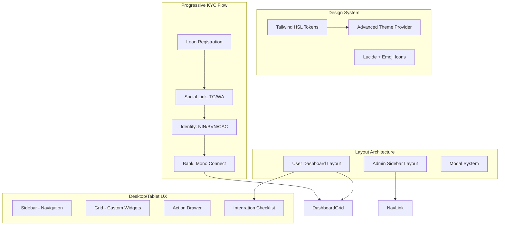

# PRISM UI Revamp & Progressive KYC (V27-V31)

## 1. Goal Description
Upgrade the PRISM UI/UX to a premium, modern experience by merging the architectural robustness of **PRISM V2** with the feature-rich complexity of **PRISM App**. The focus is on a high-end Desktop/Tablet experience with full light/dark mode support.

## 2. Design Philosophy
- **Rich Aesthetics**: Vibrant gradients, glassmorphism (translucent backdrops), and micro-animations.
- **Fact-Focused Layout**: Information density centered around tax health and verifiable rules.
- **Channel Agnostic**: Seamless consistency across Web, WhatsApp, and Telegram integrations.

---

## 3. Architectural Map (V27)

---

## 4. Proposed Changes

### [A] Design Tokens (Tailwind HSL)
Migrate to a centralized HSL color system for maximum flexibility across themes.
- **Primary**: `hsl(248, 80%, 36%)` (Royal Nigerian Indigo)
- **Accent**: `hsl(164, 59%, 58%)` (Vibrant Mint)
- **Warning**: `hsl(38, 100%, 58%)` (Compliance Amber)

### [B] Admin Sidebar (Desktop-First)
- **Collapsible States**: Full (256px) vs. Mini (64px).
- **Glassmorphism**: `backdrop-blur-xl` and `bg-white/70` in light mode.
- **Contextual Search**: Global search (Cmd+K) for files, rules, and users.

### [C] User Dashboard (Tablet-First)
- **Tax Health Score Widget**: Radial progress indicator with gradient fill.
- **Transaction Cards**: Modern, elevated cards with hover-to-reconcile actions.
- **Smart Insights**: Sidebar widget for AI-generated tax tips.

### [D] Theme Engine
- **Dark Mode**: `hsl(240, 30%, 16%)` base background.
- **Light Mode**: Pure white with soft `border-gray-200`.
- **System Detection**: Automatic sync with OS preference.

---

## 5. Progressive KYC & Onboarding (V31 Integration)
- **Lean Registration**: Refactor `Register.tsx` to collect only Name, Email, Phone, and Password. Email confirmation remains the immediate follow-up.
- **Integration Checklist**: High-visibility "Onboarding Widget" on the Dashboard:
    1.  **Link Social**: Telegram or WhatsApp (mandatory first step).
    2.  **Verify Identity**: Mono Identity lookup for NIN/BVN (Verification only, NO local storage). CAC lookup for businesses.
    3.  **Connect Bank**: Unlock Mono bank connection only after Identity is confirmed.
- **Manual Human Fallback**: "Contact Verification" button if lookup fails, prompting the user to email documents to PRISM (manual process, no in-app file storage).

---

## 6. Maximum User Experience (UX) Suggestions
1. **Micro-Interactions**: Subtle scale-up on card hover, slide-in transitions for sidebars.
2. **Skeleton Loading**: Progressive loading for charts and tables to reduce perceived latency.
3. **Optimistic Updates**: Immediate UI feedback for transaction categorization.
4. **Desktop Shortcuts**: Hotkeys for frequent actions (e.g., `N` for new project, `C` for chat).

---

## 6. Implementation Phases (V27-V30)
| Phase | Title | Focus |
|-------|-------|-------|
| **V27** | **Design Tokens & Theme** | HSL migration, Dark Mode foundations, Lean Reg |
| **V28** | **Desktop Navigation** | Collapsible sidebars, Integration Checklist UI |
| **V29** | **Widget Overhaul** | Radial Tax Health, Glassmorphism cards |
| **V30** | **Mobile Optimization** | Responsive breakpoints & Bottom nav |
| **V31** | **Progressive Integrations**| Mono Identity (No storage), CAC Lookup, Linkages |

---

*Prepared for: Antigravity Agent*
*Reference: PRISM V2 Design Ethos*
