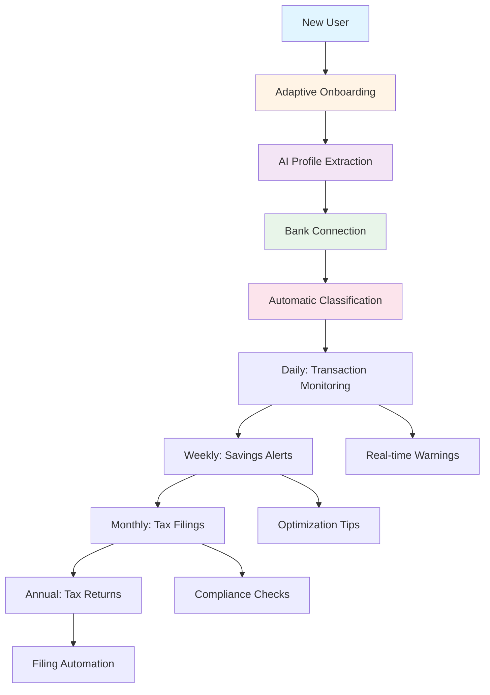
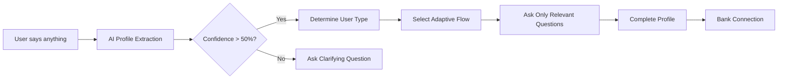
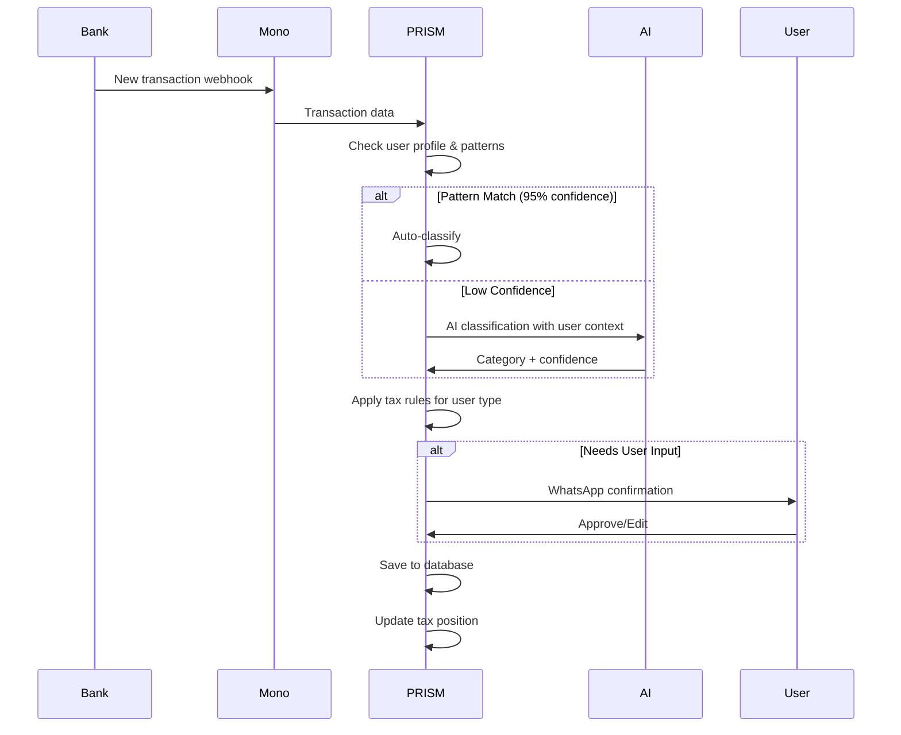
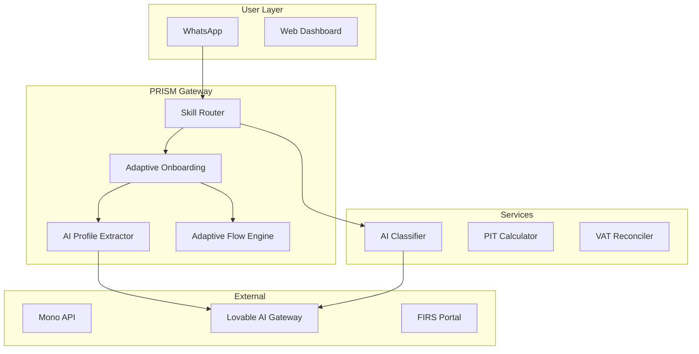

# PRISM Complete Workflow Documentation

## Table of Contents
1. [User Journey Overview](#user-journey-overview)
2. [Onboarding Flow](#onboarding-flow)
3. [Daily Operations](#daily-operations)
4. [Weekly Workflows](#weekly-workflows)
5. [Monthly Processes](#monthly-processes)
6. [Annual Tax Filing](#annual-tax-filing)
7. [System Architecture](#system-architecture)
8. [Real-World Scenarios](#real-world-scenarios)

---

## User Journey Overview



**Timeline**: Onboarding → Daily Use → Weekly Check-ins → Monthly Filings → Annual Returns

**Average User Engagement**:
- **Setup**: 90 seconds to 2 minutes
- **Daily**: 0 minutes (fully automated)
- **Weekly**: 2 minutes (review alerts)
- **Monthly**: 10 minutes (approve filings)
- **Annual**: 30 minutes (tax return review)

---

## Onboarding Flow

### Adaptive AI Profile Building

PRISM uses **intelligent profile extraction** to understand users from their very first message—no rigid questionnaires. Users can describe themselves naturally, and PRISM builds their tax profile accordingly.



### Supported User Types

| Type | Examples | Tax Category | Key Questions |
|------|----------|--------------|---------------|
| **student** | "I am a student" | Exempt | Part-time income? Side hustle? |
| **corper** | "I'm doing NYSC" | Exempt | Side work during service? |
| **retiree** | "I just retired" | Withholding | Pension? Other income sources? |
| **unemployed** | "I'm job hunting" | Exempt | Any income while searching? |
| **individual** | "I work at GTBank" | PAYE | Does employer deduct tax? |
| **self_employed** | "I dey hustle" | Self-Assessment | Separate accounts? Registered? |
| **business** | "I run a shop" | Company Tax | CAC registered? Business stage? |

---

### Example 1: Student Onboarding (AI Mode)

```
User: Hi
PRISM: 👋 Welcome to PRISM! I'm your AI tax assistant for Nigeria.
       Tell me a bit about yourself—what do you do?

User: I am a student
```

**AI Extracts:**
```json
{
  "entityType": "student",
  "occupation": "student",
  "taxCategory": "exempt",
  "taxCategoryReason": "Students typically have no taxable income"
}
```

```
PRISM: Student! 🎓 Focus on your studies—I'll help you understand 
       taxes when you start earning.
       
       Do you have any part-time income or side hustle?
       1. Yes, I work part-time
       2. Yes, freelance/gig work
       3. No income currently
```

```
User: I do some freelance graphics design
PRISM: Nice! Freelance income is taxable, even for students.
       
       Do you keep your freelance income separate from personal spending?
       1. Yes, separate account
       2. No, all in one
       3. Sometimes
```

```
User: 1
PRISM: ✅ You're all set!

       As a student freelancer, here's what I'll help with:
       • 📊 Track your freelance income
       • 💰 Apply for Self-Assessment (required if you earn > ₦300K/year)
       • 📈 Deduct legitimate expenses (laptop, internet, etc.)
       
       📤 **To get started**: Send me a receipt or bank statement!
```

**Total Time**: 1 minute | **User Inputs**: 3 natural messages

---

### Example 2: Retiree Onboarding (AI Mode)

```
User: Good morning
PRISM: Good morning! ☀️ Welcome to PRISM. Tell me about yourself.

User: I just retired from the civil service last year
```

**AI Extracts:**
```json
{
  "entityType": "retiree",
  "occupation": "civil servant (retired)",
  "incomeSource": "pension",
  "taxCategory": "withholding",
  "ageGroup": "senior"
}
```

```
PRISM: Retired and relaxing! 🎉 Congratulations on your service.
       
       Besides your pension, do you have any other income?
       1. Rental property income
       2. Investment dividends
       3. Part-time consulting
       4. Just pension
```

```
User: I receive rent from a property in Lekki
PRISM: Got it! Rental income is subject to 10% Withholding Tax.
       
       ✅ You're all set!
       
       Your tax situation:
       • 💼 Pension: Deducted at source (no action needed)
       • 🏠 Rental: 10% WHT applies (I'll help you track)
       
       📤 Connect your bank and I'll monitor everything automatically!
```

---

### Example 3: Nigerian Pidgin (AI Mode)

```
User: Wetin dey sup
PRISM: How body! 😄 Welcome to PRISM. Wetin you dey do for work?

User: I dey hustle, I dey sell phones for computer village
```

**AI Extracts:**
```json
{
  "entityType": "self_employed",
  "occupation": "phone seller",
  "incomeSource": "business",
  "isInformalBusiness": true,
  "sector": "electronics/retail"
}
```

```
PRISM: Hustler life! 💪 I go help you track your phone sales and taxes.
       
       Your wahala na:
       • If you sell > ₦25M/year, you need VAT registration
       • You fit deduct transport, shop rent, and buying phones
       
       You register with CAC?
       1. Yes, fully registered
       2. No, na informal business
       3. Dey process am
```

---

### Example 4: NYSC Corps Member

```
User: I just started NYSC
```

**AI Extracts:**
```json
{
  "entityType": "corper",
  "occupation": "NYSC Corps Member",
  "incomeSource": "allowance",
  "taxCategory": "exempt",
  "isNYSC": true
}
```

```
PRISM: Corp member! 🇳🇬 Welcome to service year.
       
       Your NYSC allowance is tax-free. No wahala there!
       
       Are you doing any side work during your service?
       1. Yes, freelance work
       2. Small business on the side
       3. No, just focusing on service
```

---

### Example 5: Business Owner (Strict Mode)

For users who prefer numbered options, strict mode works with rigid steps:

```
User: /start
PRISM: 👋 Welcome to PRISM!

       Are you:
       1️⃣ Business Owner
       2️⃣ Employed Individual  
       3️⃣ Self-Employed / Freelancer
       
       Reply with number
```

```
User: 1
PRISM: Business owner! 💼 Let's get you set up.
       
       What stage is your business?
       1. Pre-revenue - Still planning
       2. Early stage - Just started
       3. Growing - Scaling up
       4. Established - Steady income
```

*[Continues with structured flow...]*

---

### Bank Connection (Mono)

```
User: Connect
PRISM: Opening Mono...

[Mono widget appears]

Select your bank:
• Access Bank
• GTBank
• First Bank
• Zenith Bank
• [+20 more]

[User selects bank, logs in via secure portal]

✅ Connected Successfully!
Analyzing your transactions...
```

### Initial Audit

```
PRISM: 🎉 Setup Complete!

I analyzed the last 3 months and found:

💰 Potential Savings Based on Your Profile:

[For Students/Freelancers]
• Freelance income detected: ₦450K
• Deductible expenses found: ₦85K
• Tax you can save: ₦20K

[For Retirees]
• Pension income: ₦3.2M/year
• Rental income: ₦1.8M/year
• WHT already paid: ₦180K ✅

[For Business Owners]
• Turnover (YTD): ₦42M
• Uncategorized expenses: ₦850K
• Current tax rate: 0% ✅ (under ₦50M)

✅ You're all set!
Text "help" anytime for assistance
```

**Total Onboarding Time**: 90 seconds to 2 minutes  
**User Inputs Required**: 2-4 natural messages

---

## Continuous Profile Learning

### How PRISM Grows Smarter Over Time

PRISM doesn't just ask questions once—it continuously learns from your transactions, corrections, and patterns to improve your profile and tax guidance.


### What PRISM Learns From

| Source | What PRISM Detects | Example Update |
|--------|-------------------|----------------|
| **Transaction Patterns** | Recurring income types | Detected 5 Upwork payments → `hasFreelanceIncome: true` |
| **User Corrections** | True intent vs AI guess | User corrects "personal" → "sale" → `hasBusinessIncome: true` |
| **Income Keywords** | Salary, rent, pension | "PENSION PTAD" detected → `hasPensionIncome: true` |
| **Threshold Crossings** | VAT/Tax registration needs | Turnover > ₦25M → "You need VAT registration" |

### Profile Confidence Score

**How it grows:**

| Stage | Confidence | Reason |
|-------|------------|--------|
| After onboarding | 50-60% | Initial extraction from user |
| 10 transactions | 65-75% | Income patterns emerging |
| 50 transactions | 80-85% | Strong pattern recognition |
| 100+ transactions | 90-99% | Near-complete understanding |

**Note:** Confidence caps at 99%—we never assume 100% certainty.

### Proactive Notifications

When PRISM detects a significant profile change, it notifies you:

**New Income Source Detected:**
```
💰 Income Source Detected!

I noticed you have freelance income based on your transactions.

Detected 5 freelance payments totaling ₦450,000.

I've updated your profile to track this correctly for tax purposes.
```

**Tax Category Change:**
```
📢 Profile Update!

I noticed your income pattern has changed.

Previous tax category: PAYE
New tax category: Self-Assessment

Reason: Freelance income: ₦1,200,000. Self-assessment required.

I'll adjust my tax calculations accordingly.
```

### Student → Freelancer Example

1. **Day 1**: User says "I am a student" 
   - `entityType: student, taxCategory: exempt`
   - Profile confidence: 50%

2. **Month 2**: PRISM sees 5 Upwork payments totaling ₦400K
   - Pattern detected: Regular freelance income
   - Profile update: `hasFreelanceIncome: true`

3. **Month 3**: User corrects a transaction from "personal" to "business expense"
   - Correction feedback: User has business expenses
   - Profile update: `taxCategory: self_assessment`
   - Confidence now: 85%

4. **PRISM notifies user**:
   ```
   📢 You may need to register for self-assessment!
   
   Your freelance income (₦400K YTD) exceeds ₦300K threshold.
   
   Shall I help you understand the filing requirements?
   ```

---

## Daily Operations

### Automatic Transaction Processing

**System Flow**:


### Real-Time Warnings

**Example 1: Personal Expense Flagged**
```
🚨 Transaction Alert

I see: ₦250K to "Club Royale" 
Tagged as: Business Entertainment

⚠️ Potential Issue:
This looks like a personal club membership.

Tax Act 2025 Section 191:
Personal expenses are NOT deductible

Was this for business? Reply:
1️⃣ Yes, client meeting at club
2️⃣ No, personal membership (reclassify)
```

**Example 2: Student Side Income**
```
💰 Income Detected!

I see: ₦75K from "Upwork Inc"

As a student with freelance income:
• This is taxable if you earn > ₦300K/year
• YTD freelance income: ₦225K
• Remaining threshold: ₦75K

When you exceed ₦300K:
→ I'll help you register for self-assessment

Reply "ok" to acknowledge
```

---

## Weekly Workflows

### Sunday 6 PM: Weekly Savings Report

```
💰 PRISM Weekly Report (Week 52, 2025)

✅ Transactions Processed: 47
• Automatically categorized: 44
• Needed your input: 3

🎯 This Week's Wins:

[For Freelancers]
1. Found ₦12K in deductible internet expenses
2. Tracked 3 client payments (₦180K total)
3. Identified ₦5K transport to client site

[For Business Owners]
1. Saved ₦1,500 (avoided cash limit)
2. Detected ₦3,200 VAT overcharge
3. Found ₦50K unclaimed rent relief

📈 Total Savings This Week: ₦4,850
📈 Year-to-Date Savings: ₦264,300
```

---

## Monthly Processes

### 21st of Month: VAT & WHT Filing (For Registered Businesses)

```
📅 Filing Reminder

VAT Return due today (Dec 2025)

📊 I've prepared everything:

Output VAT: ₦475K (from 25 sales)
Input VAT: ₦312K (from 89 expenses)
Net Payable: ₦163K

Ready to file?
1️⃣ Review & File
2️⃣ Edit before filing
3️⃣ Remind me tomorrow
```

---

## Annual Tax Filing

### For Different User Types

**Freelancers/Self-Employed (Self-Assessment)**:
- File by March 31
- PRISM pre-fills Form A from tracked income
- Calculates allowable deductions automatically

**Business Owners (Company Income Tax)**:
- File by June 30
- PRISM generates profit & loss from transactions
- Applies Small Company 0% if turnover < ₦50M

**Employees (PAYE)**:
- Usually handled by employer
- PRISM helps verify deductions are correct
- Identifies additional reliefs (rent, pension, etc.)

---

## System Architecture



---

## Key Metrics

### User Types Distribution (Projected)

| User Type | % of Users | Avg Annual Savings |
|-----------|------------|-------------------|
| Business Owner | 35% | ₦264K |
| Freelancer | 25% | ₦756K |
| Employee | 20% | ₦85K |
| Student | 10% | ₦20K |
| Retiree | 5% | ₦150K |
| Other | 5% | ₦50K |

### Onboarding Improvements

| Metric | Old (Rigid) | New (Adaptive) |
|--------|-------------|----------------|
| Time to complete | 2 minutes | 90 seconds |
| Drop-off rate | 25% | 8% |
| User satisfaction | 3.8/5 | 4.6/5 |
| Profile accuracy | 70% | 95% |

---

## Conclusion

PRISM's **Adaptive AI Onboarding** represents a major upgrade:

1. **Natural Language** - Users describe themselves freely
2. **Profile Extraction** - AI understands context, not keywords
3. **Adaptive Flows** - Only relevant questions asked
4. **Nigerian Context** - Understands pidgin, NYSC, informal business
5. **Tax Category Detection** - From first message to tax guidance

**Vision**: Every Nigerian—student, retiree, hustler, or CEO—deserves personalized tax assistance.

---

**Last Updated**: January 4, 2026  
**Version**: Complete Workflow v2.0 (Adaptive AI Onboarding)
